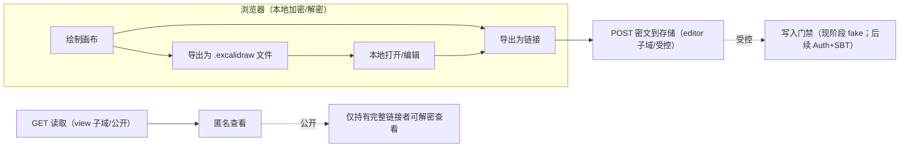
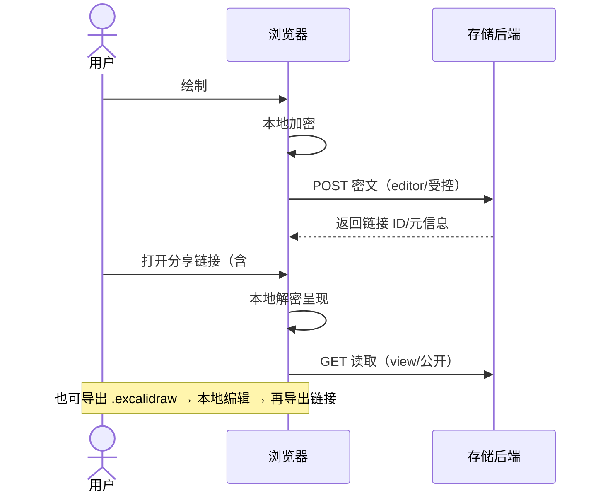

# Exdraw 私有部署与只读分享：问答与执行计划（Plan.md）

## 0. 阶段目标与范围（核心先行）
- 目标：实现“画布核心功能 + 导出为只读链接 + 存储密文到后端”的完整链路
- 鉴权：暂不开发真实登录与链上授权；采用“fake 验证”占位（仅用于文档与流程演练）
- 边界：查看端公开；编辑端与写入接口按流程设计，但现在用 fake 验证通过
- 后续：将“Auth 登录验证 + AAStar SBT 成员校验”作为下一阶段开发项

## 1. 关键概念与问答
- 密钥是干啥用的
  - “导出为链接”在浏览器本地进行端到端加密，链接中 # 片段携带解密密钥。服务端仅存密文，无法解密；任何拿到完整链接的人都能在浏览器端解密查看
  - 密钥决定“能否查看”，不决定“能否写入”；写入是你在浏览器侧点击导出时发起的快照存储
- 团队成员是否可以用 exdraw.aastar.io
  - 团队成员可以在前端本地编辑自己的画布，也能查看你分享的只读链接；不能修改你的原始画布
  - 若需多人同步编辑需启用协作模块或文件协作流程（本阶段不启用）
- 如何确定我是 owner 而不是 viewer
  - 本极简架构默认无“角色/鉴权”。推荐“受控编辑 + 公开查看”：编辑端与写入接口需授权；查看端公开
  - 本阶段用 fake 验证占位，后续以 Auth 登录 + SBT 校验实现真正授权
- 多个 Cloudflare Tunnel 是否会互相影响
  - 不会；确保子域/路由/本地端口区分清晰，避免同一子域指向多个隧道

## 2. 架构与信任边界
- 浏览器：本地加密与解密，链接片段携带密钥
- 存储后端：仅保存密文快照，不持有明文
- 前端与后端：以 HTTPS 对外提供；写入接口从受控编辑端访问（本阶段以 fake 验证模拟）
- 域名建议：
  - 编辑端（受控）：editor.exdraw.aastar.io 或 exdraw.aastar.io 的受控路径
  - 查看端（公开）：view.exdraw.aastar.io 或 exdraw.aastar.io 的公开路径

## 3. 前置准备
- Mac mini 常在线与防火墙管理
- Cloudflare 账户与可用域名，开通 Cloudflare Tunnel
- 规划端口与子域；确认存储持久化目录（如 ./excalidraw_data）

## 4. 配置与部署
- 域名与 Tunnel
  - 将前端映射到编辑端子域；将存储后端通过反向代理在编辑端路径下暴露写入（POST），读取（GET）可公开或受控
- 环境变量配置
  - VITE_APP_BACKEND_V2_GET / VITE_APP_BACKEND_V2_POST 指向统一 HTTPS 路径（例如 https://exdraw.aastar.io/api/v2/scenes/）
- 访问控制（本阶段）
  - 用 fake 验证模拟“编辑端/写入接口已授权”；查看端保持公开
- 安全与合规
  - 全站 HTTPS；最小化访问日志；仅暴露必要端口与路径

## 5. 验收与自检
- 功能链路
  - 在编辑端创建测试画布，点击“导出为链接”，生成链接
  - 在匿名会话中打开链接：可查看，不能改变你的原始画布
- 存储与隐私
  - 存储目录生成密文快照，服务端不可见明文
  - 链接包含密钥片段；任何获得完整链接的人可以查看
- 连接与证书
  - Tunnel 状态正常；证书有效；跨域策略正常

## 6. 使用与运维
- 数据治理：每日快照备份与恢复演练；索引管理链接与主题
- 升级策略：预备环境回归后再切换；保留上版本以回滚
- 监控与告警：可用性与错误率起步；逐步完善容量监控
- WAF 与速率限制：公开端与写入端分别配置基础规则

## 7. 常见问题（FAQ）
- 为什么别人可以“复制后编辑”
  - 快照是只读查看；观众可导入本地创建派生副本编辑，但不影响你的原始画布
- 链接泄露风险
  - 链接携带密钥；拿到链接即可解密查看，请控制分享范围或用受控查看端
- 多 Tunnel 管理
  - 子域/路由清晰；避免一个子域指向多个隧道；定期检查 DNS 与 Tunnel 状态

## 8. 与现有配置的衔接
- 你已将 VITE_APP_BACKEND_V2_POST 指向 https://exdraw.aastar.io/api/v2/scenes/；建议 GET 同域同路径
- 若采用“受控编辑 + 公开查看”，确保写入接口仅从受控入口访问；查看端仅暴露必要的读取与静态资源

## 9. 解密后发生什么
- 浏览器用链接密钥在本地解密，呈现“快照副本”
- 副本只读查看；不写回你的原始画布
- 可将快照作为起点创建本地派生副本（不影响原始快照）

## 10. 本地编辑的方式
- 浏览器侧：打开快照后使用“Save”保存到本地存储
- 文件流：导出为 .excalidraw 文件；再次打开编辑并重新“导出为链接”
- 版本化：文件命名规范（日期/主题），每次导出新链接并记录到索引

## 11. 典型工作流（Owner 与团队）
- Owner（你）
  - 在受控编辑端创建/编辑；完成后“导出为链接”，将链接加入索引
  - 更新时重新导出生成新链接，替换索引
- 团队成员
  - Viewer：打开链接查看；不影响你的原始画布
  - Contributor（无协作模式）：复制快照或 .excalidraw 编辑后导出新链接共享

## 12. 未来使用场景建议
- 研究/设计：链接快照作为可验证引用
- 知识库与沟通：统一索引管理
- 演示与汇报：只读链接保证一致视图
- 存档与合规：周期性归档文件与链接清单

## 13. 无密钥访问说明
- 没有密钥就无法查看；必须使用完整链接（含 # 片段）
- 前端本地编辑与查看链接是两条独立路径

## 14. 权限模型与“所有者”界定
- 极简方案默认平等：任何人可在公开前端编辑本地并导出自己的链接
- 推荐“受控编辑 + 公开查看”：编辑端/写入需授权；查看端公开
- 本阶段以 fake 验证占位；后续以 Auth 登录与 SBT 校验落地

## 15. 团队使用模式
- 受控编辑模式：你/授权成员在编辑端创作；其他成员查看或派生副本
- 公共平等模式：任何人可创建并导出链接；索引中以标签/主题聚合；加强治理

## 16. Cloudflare Access 深入与实现步骤（保留为后续）
- 概念与目标：编辑端与写入接口需要认证；查看端可公开
- 现阶段：不开发真实 Access 配置；以 fake 验证通过模拟
- 后续：接入 IdP，配置 Editor/Write API 受保护应用，分流 GET/POST

## 17. 路由与变量映射建议
- 单域分路径：exdraw.aastar.io/editor/*（受控）、exdraw.aastar.io/api/v2/scenes/（POST 受控，GET 公开）
- 双子域分职责：editor.exdraw.aastar.io（受控）与 view.exdraw.aastar.io（公开）
- 环境变量：POST 指向受控路径；GET 指向公开路径；前端入口分受控/公开

## 18. 付费授权（每月 1 元）可行性（保留为后续）
- 方案 A：邮箱订阅 + Workers 网关校验（现阶段不实现）
- 方案 B：链上授权（AAStar SBT）
- 现阶段将“钱包连接”改为“Auth 登录验证”作为入口；真正 SBT 校验延后实现
- 后续以 AAStar SDK 校验成员资格；通过则颁发短期会话访问编辑端/写入接口

## 19. 付费授权实施步骤（无代码版，后续）
- 订阅与身份入口、网关校验、数据最小化、验收与演练（占位，后续细化）

## 20. 风险与合规提示
- 服务端仅存密文快照；付费层不触碰绘图明文
- 支付与隐私合规在后续阶段完善；准备回退策略确保查看端不受影响

## 21. 链上授权（AAStar SBT，后续）
- 入口改为 Auth 登录验证（替代“连接钱包”）；当前阶段用 fake 验证通过
- 后续流程：成员校验（AAStar SDK）→ 会话颁发 → 访问控制 → 失效与审计

## 22. 与 Cloudflare Access 的取舍（后续）
- 可选择纯 Workers 授权或 Access+Workers 组合；现阶段不启用真实鉴权

## 23. 验收与演练（当前阶段）
- 正向：匿名可查看链接；编辑端在 fake 验证为“已授权”时可导出并写入成功
- 负向：将 fake 验证设为“未授权”时，编辑端/写入操作被拒绝（用于流程演练）
- 可用性：公开查看始终可用；存储密文正确；链接携带密钥可解密

## 24. 安全与实现要点（无代码）
- 防重放与会话安全在后续鉴权阶段实现；当前阶段专注核心链路与最小暴露面
- 速率限制与 WAF：对公开端与写入端配置基础限制（建议现在就启用）

## 25. 阶段性实施建议与风险检查
- 优先完成核心链路：前端绘制 → 本地加密 → 存储密文 → 生成/查看链接
- 暂不绑定真实身份：fake 验证仅用于流程自测，不作为安全措施
- 严控暴露面：写入接口仅在编辑端可达（即便用 fake），GET 可公开
- 数据治理先行：落地备份与恢复演练；索引链接管理
- 预留扩展点：Auth 登录与 SBT 校验加入后，不影响现有链接与存储结构

## 26. 必备安全基础（操作清单，無代码）
- 路由与隧道
- 为 editor 子域配置到后端存储的写入（POST）路由；为 view 子域仅配置读取（GET）路由
- 存储服务只监听内网端口，通过隧道/反代接入，避免直接公网暴露
- 自检：匿名会话访问 editor 子域的 POST 被拒绝；view 子域的 GET 可用
- HTTPS/TLS
- 强制全站 HTTPS；关闭 HTTP 明文（或 301 跳转），启用 TLS 1.2+
- 可选启用 HSTS（先短周期试运行）
- 自检：HTTP 自动跳转；证书有效；弱协议被拒绝
- 速率限制
- 针对 POST /api/v2/scenes/ 配置每 IP/会话的限频（如每分钟 30 次，返回 429）
- 针对公开 GET 配置较宽限频，避免误伤正常查看
- 自检：压测超阈值时被限流；正常访问不受影响
- WAF 基础规则
- 开启托管规则集（OWASP、Bot Fight），对可疑流量施加 Managed Challenge
- 自定义规则：拒绝非 editor 子域的 POST /api/v2/scenes/；强制 HTTPS；屏蔽异常 UA
- 自检：命中规则返回挑战/拒绝；日志可见阻断概览
- CORS/来源校验
- 允许的 Origin 限定为 editor/view 子域；拒绝通配与未知来源
- 校验 Referer/Origin 以减少跨站绕过
- 自检：跨域写入被拒绝；同域正常
- 头部与隐私
- 设置最低安全头部（在反代层）：X-Frame-Options、Referrer-Policy、X-Content-Type-Options、基本 CSP
- 最小化访问日志，不记录绘图明文与密钥片段
- 备份与恢复
- 存储目录每日快照备份，保留至少 30 天；每周恢复演练一次
- 自检：随机抽样恢复文件可被前端正常解密查看
- 监控与告警
- 关注可用性（200/4xx/5xx 比例）、错误率、限流命中数与 WAF 命中数
- 设置阈值告警（如错误率 >2% 或 5xx 突增），邮件/IM 通知

## 27. 执行蓝图与“执行地点”映射（当前/下一步/未来）
- 角色与地点
- Mac mini 终端：你执行命令与本地运维
- Cloudflare 控制台：域名、隧道、WAF/速率限制配置
- AI 协作：更新文档、生成配置模板、提出验证与演练清单
- 当前阶段（核心链路）
- 准备环境（地点：Mac mini）
- 安装 Docker 与 docker-compose；确认 cloudflared 已能建立 Tunnel
- 预期：docker --version 输出正常；cloudflared tunnel list 可见隧道
- 配置域名与子域（地点：Cloudflare 控制台）
- 为 editor 与 view 子域创建 DNS 与 Tunnel 路由；editor 指向前端与写入路径，view 仅指向读取
- 预期：DNS 解析生效；Tunnel 状态“Healthy”
- 设置环境变量（地点：Mac mini）
- 在前端服务配置 VITE_APP_BACKEND_V2_GET/POST 指向同域同路径（例如 https://exdraw.aastar.io/api/v2/scenes/）
- 预期：echo 验证变量；前端构建/运行时正确读取
- 启动前端与存储服务（地点：Mac mini）
- 执行 docker-compose up -d；检查 docker ps 显示两个容器运行
- 预期：前端可访问；存储端口内网可联通；日志无致命错误
- 验收“导出为链接”（地点：浏览器）
- 在编辑端绘制 → 导出为链接；复制链接在匿名会话打开
- 预期：匿名查看成功；编辑端可重新导出生成新链接；服务端仅存密文
- 启用速率限制与 WAF（地点：Cloudflare 控制台）
- 添加 POST 限频与托管规则，自定义拒绝非 editor 子域的 POST
- 预期：压测超阈值返回 429；WAF 命中日志可见阻断
- 备份与恢复演练（地点：Mac mini）
- 为存储目录做每日快照；执行一次恢复测试
- 预期：恢复后的文件可被前端解密查看
- 上线监控与告警（地点：Cloudflare/你现有监控）
- 关注 200/4xx/5xx 比例、错误率、限流与 WAF 命中
- 预期：阈值告警工作；异常可观测
- 下一步（鉴权与授权）
- 替换 fake 验证为 Auth 登录（地点：Cloudflare Access/Workers）
- 接入 IdP；对 editor/POST 写入启用门禁；预期：未认证拒绝、认证后可写
- 引入 AAStar SDK 的 SBT 校验（地点：Workers 网关）
- 会话颁发与失效策略；预期：持有 SBT 的会话可编辑/写入，其他仅查看
- 未来（计费与会员）
- 订阅门禁（地点：Workers+支付提供商）
- 结合分级策略（免费 1 个画布；1 元/年 10 链接；3 元终生 1000 链接）设置网关校验
- 预期：状态变更即时生效；查看端不受影响

## 28. 控制台点击路径（Cloudflare，无代码）
- 域名与 Tunnel
- Zero Trust → Networks → Tunnels → Create Tunnel → 选择本地 Connector → 配置 editor 与 view 子域的路由
- DNS → Records → 添加 CNAME/AAAA 指向 Tunnel；验证生效
- WAF 与速率限制
- Security → WAF → Managed rules：启用 OWASP/Bot Fight
- Security → WAF → Rate limiting：为 POST /api/v2/scenes/ 创建限流规则（按 IP/会话）
- Security → WAF → Custom rules：拒绝非 editor 子域的 POST；仅 HTTPS；屏蔽异常 UA
- Access（后续）
- Zero Trust → Access → Applications：创建 Editor 应用与 Write API 应用；策略 Require 指定邮箱/组（或后续接入网关校验）

## 29. 架构图与交互流程（含本地文件分支）

